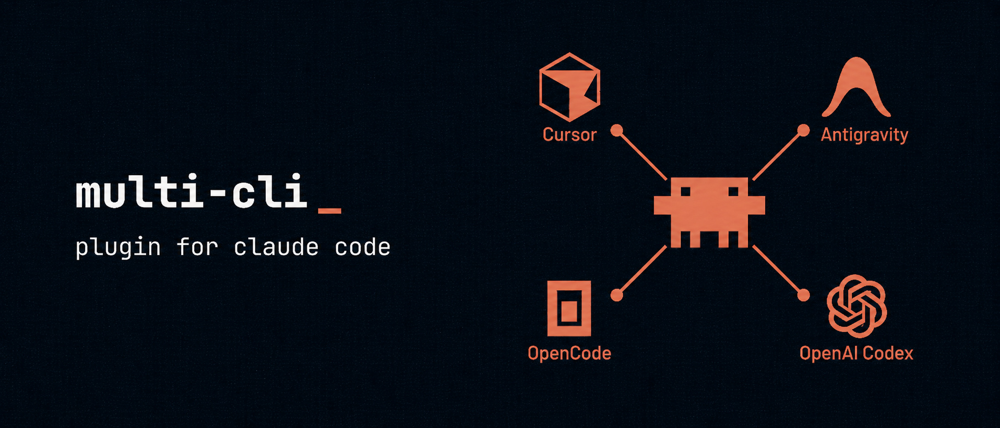

# cc-multi-cli-plugin

[](LICENSE)
[](https://github.com/greenpolo/cc-multi-cli-plugin/releases)
[](https://docs.anthropic.com/en/docs/claude-code)
[](#commands)
[](https://github.com/greenpolo/cc-multi-cli-plugin/stargazers)

If you have access to multiple AI coding CLIs (Codex, Cursor, Antigravity), this plugin lets Claude Code delegate to whichever one is best for the task — without you having to switch tools or run them yourself.

Each CLI is wired up through its native transport (Codex via ASP, Cursor via headless `agent -p`, Antigravity via its headless `agy` CLI). This lets you pick and choose the best features from each — like `/cursor:delegate` for fast implementation, `/codex:review` for code review, or `/antigravity:research` for deep research. Sessions, streaming, tool calls, and background jobs all work normally.

## Install

Paste into Claude Code:

```
/plugin marketplace add https://github.com/greenpolo/cc-multi-cli-plugin
/plugin install multi@cc-multi-cli-plugin
/multi:setup
```

`/multi:setup` detects which CLIs you have, installs the matching sub-plugins, and wires Exa + Context7 MCPs into each.

## Skills Included:

Two skills ship with the plugin:

- **multi-cli-anything** — adds ANY CLI (Aider, OpenCode, anything that speaks ACP, ASP, or a structured RPC transport) as a subagent that Claude can invoke at will. Claude scaffolds the new plugin in the marketplace.

- **customize** — change which CLI handles what. *"Make Codex the executor instead of Cursor."* Claude does the file edits, reinstalls, and tells you what restarts are needed.

Just ask Claude in plain English. The skills activate automatically.

## Commands

Provider commands live under each CLI's namespace; the cross-cutting `/multi:*` commands operate the shared runtime.

| Command | What it does |
|---|---|
| `/codex:execute` | Delegate a specific plan or plan step to Codex |
| `/codex:rescue` | Hand a stuck or open-ended problem to Codex for an independent investigation |
| `/codex:review` | Codex code review of your working tree or a branch (read-only) |
| `/codex:adversarial-review` | Adversarial design/code review — challenges the approach, not just the diff (read-only) |
| `/cursor:delegate` | Delegate an implementation task or plan step to Cursor (agentic; writes code; supports `--until-done`) |
| `/cursor:research` | Read-only external web/documentation research via Cursor |
| `/cursor:explore` | Read-only codebase exploration via Cursor |
| `/antigravity:research` | Deep external research with Antigravity (Gemini 3.5 Flash, read-only; experimental) |
| `/antigravity:explore` | Fast codebase exploration with Antigravity (Gemini 3.5 Flash, read-only; experimental) |
| `/multi:setup` | One-shot wizard — detects CLIs, configures Exa + Context7 MCPs |
| `/multi:status` | Show active and recent background jobs for this repo |
| `/multi:result` | Show the stored final output for a finished job |
| `/multi:cancel` | Cancel an active background job |

Claude can also auto-dispatch the provider commands without you typing them.

All of them are interchangeable, and can be altered to whatever you want using the `customize` skill.

## Known issues

These are upstream CLI quirks and current limitations. If you hit something not listed, set `ACP_TRACE=1` and check stderr — that reveals which JSON-RPC traffic is or isn't crossing the wire (ACP CLIs only; Antigravity does not use ACP).

- **Cursor runs in headless `agent -p` mode** (not ACP). The adapter delivers the prompt on stdin, selects the model with `--model` (default `auto`), and parses `json`/`stream-json` output. This sidesteps the older ACP-mode bugs (silent MCP drop, model-hint quirks). MCP servers come from Cursor's own `~/.cursor/mcp.json`, which `/multi:setup` maintains.

- **Cursor's shell is slow/unreliable on Windows.** Cursor's terminal tool can stall or wait out a per-command timeout on Windows (host-PATH/WSL, open upstream). So `/cursor:delegate` does **not** run build/test verification itself — it lists the commands in a `## Verification` block and Claude runs them. File writes and web/codebase reads are unaffected.

- **Antigravity runs via the headless `agy` CLI (experimental).** Install the `agy` CLI (https://antigravity.google) and run `agy` once interactively to sign in — the desktop app is **not** required. `/multi:setup` reports whether `agy` is detected.

- **Antigravity reads its answer from a transcript, not stdout.** `agy`'s headless print mode (`agy -p`) currently emits nothing to stdout when piped (an upstream bug, gemini-cli#27466, unfixed as of agy 1.0.3), so the adapter recovers the model's answer from `agy`'s on-disk conversation transcript. Consequences: read-only `research`/`explore` only (no write-`delegate`), the model is fixed to **Gemini 3.5 Flash** (no per-call `--model`), and there are no token-usage metrics on this path. This is a deliberate workaround pending the upstream stdout fix.

When upstream CLIs change behavior, the plugin's adapters absorb it — these notes track the current state.

## License

Apache 2.0. See [NOTICE](NOTICE) for upstream credits.
